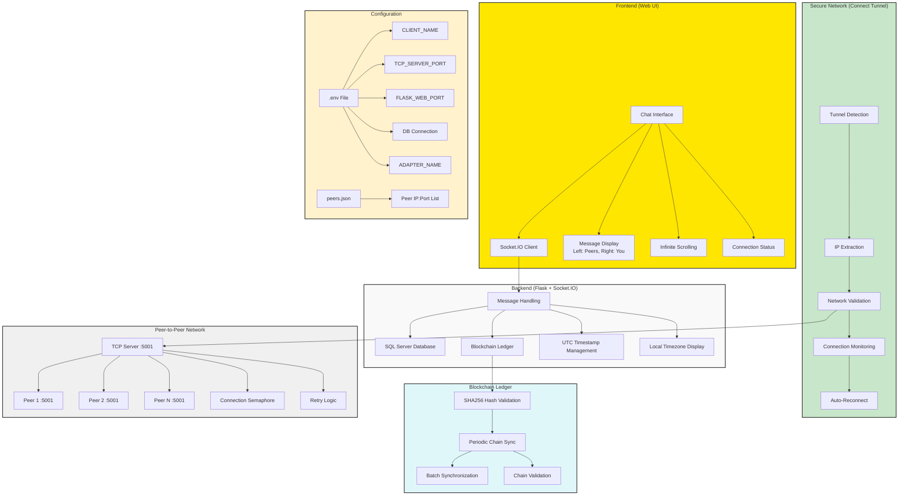

# ey-gds-group-chat-app
 (https://github.com/MadhuriSakunde1995/ey-gds-group-chat-app.git)

A decentralized group chat application where all messages are stored on a blockchain ledger, ensuring consistency, security, and automatic synchronization between peers.

## Table of Contents
- [Features](#features)
- [Architecture Overview](#architecture-overview)
- [Prerequisites](#prerequisites)
- [Installation](#installation)
- [Configuration](#configuration)
- [Connect Tunnel Integration](#connect-tunnel-integration)
- [Running the Application](#running-the-application)
- [Peer Configuration](#peer-configuration)
- [Usage](#usage)
- [Troubleshooting](#troubleshooting)
- [Security Considerations](#security-considerations)

## Features

### Frontend (Web UI)
Built with **Flask + Socket.IO**, providing a real-time chat interface with:
- Messages displayed on the **left (peers)** or **right (you)**
- Timestamps in user's local timezone (configured via `USER_TIMEZONE`)
- Infinite scrolling to load older messages
- Connection status indicators
- Automatic refresh/check for new messages
- Real-time message synchronization across all peers

### Message Handling
When a user sends a message:
1. Saved in **SQL Server database** (`messages` table for raw messages, `ledger` table for blockchain storage)
2. **Block is created** (sender + UTC timestamp + message + previous hash → new hash using SHA256)
3. Block is **broadcasted to all peers** via TCP connections
4. Message appears with local timezone display while maintaining UTC in blockchain

### Blockchain Ledger
Each message is part of a **blockchain** that:
- Guarantees **tamper resistance** through SHA256 hash links
- **Validates the chain periodically** (every `SYNC_INTERVAL` seconds)
- **Requests batch sync from peers** if validation fails

### Peer-to-Peer Networking
- Nodes connect to peers from **`peers.json`** configuration
- Each node runs a **TCP server** on `TCP_SERVER_PORT` to accept peer connections
- Messages and blocks are shared directly between peers via TCP sockets
- Missing blocks are synced in **configurable batches** (`SYNC_BATCH_SIZE`)
- Connection retries with exponential backoff (`MAX_RETRIES`, `RETRY_DELAY`)

### Secure Network Communication (Connect Tunnel)
- **Automatic tunnel detection** for secure peer-to-peer communication
- **Cross-platform support** (Windows, macOS, Linux, FreeBSD)
- **IP validation** ensures connections only through specified VPN/tunnel adapter
- **Real-time monitoring** of tunnel connection status
- **Network isolation** prevents unauthorized access from non-tunnel networks

### Synchronization & Reliability
- On startup and periodically, nodes **sync ledgers** ensuring all peers have identical chat history
- Uses **semaphores** to limit concurrent peer connections (`MAX_CLIENTS`)
- **Offline peers** automatically catch up when they reconnect
- Chain validation ensures data integrity across the network

## Architecture Overview



## Prerequisites

Before running the application, ensure you have:

- **Python 3.7+** (recommended: Python 3.8 or higher)
- **pip** (Python package installer)
- **Git** (for cloning the repository)
- **SQL Server** (Express or full version)
- **ODBC Driver 17 for SQL Server**
- **VPN/Tunnel Adapter** (e.g., Connect Tunnel)

### System Requirements
- **Operating System**: Windows, macOS, Linux, FreeBSD
- **Network**: TCP connectivity between peers via secure tunnel
- **Ports**: `TCP_SERVER_PORT` (default: 5001) and `FLASK_WEB_PORT` (default: 8001)

### SQL Server Setup
1. **Install SQL Server** (Express edition is sufficient)
2. **Install ODBC Driver 17** from [Microsoft's official site](https://docs.microsoft.com/en-us/sql/connect/odbc/download-odbc-driver-for-sql-server)
3. **Create database** named as specified in your `.env` file

## Installation

### Step 1: Clone the Repository
```bash
git clone <repository-url>
cd ey-gds-group-chat-app
```

### Step 2: Install Dependencies
```bash
pip install -r requirements.txt
```

### Dependencies Include:
- `flask` - Web framework
- `flask-socketio` - Real-time communication
- `sqlalchemy` - Database ORM
- `pyodbc` - SQL Server connectivity
- `python-dotenv` - Environment variable management
- `pytz` - Timezone handling
- `psutil` - Network interface detection
- `platform` - Provides system-specific information

## Configuration

### Environment Configuration (.env)

Create a `.env` file in the root directory:

```env
# User Configuration
CLIENT_NAME=YourDisplayName
ADAPTER_NAME=Connect Tunnel
USER_TIMEZONE=Asia/Kolkata

# Network Ports
TCP_SERVER_PORT=5001
FLASK_WEB_PORT=8001

# Database Configuration (SQL Server)
DB_DRIVER={ODBC Driver 17 for SQL Server}
DB_SERVER=YOUR_SERVER\SQLEXPRESS2019
DB_NAME=chatdb
DB_TRUSTED=yes

# Peer Connection Configuration
MAX_RETRIES=5
RETRY_DELAY=3
MAX_CLIENTS=10

# Synchronization Configuration
SYNC_INTERVAL=30
SYNC_BATCH_SIZE=50
```

### Configuration Parameters Explained:

| Parameter | Description | Default |
|-----------|-------------|---------|
| `CLIENT_NAME` | Your display name in chat | DefaultUser |
| `ADAPTER_NAME` | VPN/Tunnel adapter name | Connect Tunnel |
| `TCP_SERVER_PORT` | Port for peer TCP connections | 5001 |
| `FLASK_WEB_PORT` | Port for web interface | 8001 |
| `USER_TIMEZONE` | Your timezone for message display | Asia/Kolkata |
| `DB_SERVER` | SQL Server instance name | localhost\SQLEXPRESS |
| `MAX_RETRIES` | Connection retry attempts | 5 |
| `RETRY_DELAY` | Delay between retries (seconds) | 3 |
| `MAX_CLIENTS` | Max concurrent connections | 10 |
| `SYNC_INTERVAL` | Chain sync frequency (seconds) | 30 |
| `SYNC_BATCH_SIZE` | Messages per sync batch | 50 |

## Connect Tunnel Integration

The application automatically detects and uses your VPN/tunnel adapter for secure peer-to-peer communication.

### Features

✅ **Automatic Detection**: Finds tunnel adapter on Windows, macOS, Linux, and FreeBSD
✅ **IP Extraction**: Retrieves IP address assigned to the tunnel interface
✅ **Network Validation**: Ensures peer connections are within the tunnel network
✅ **Status Monitoring**: Continuously checks tunnel connection status every 30 seconds
✅ **Security**: Rejects connections from non-tunnel networks

### How It Works

#### 1. Tunnel Adapter Detection

The application searches for network adapters based on your OS:

| Operating System | Adapter Patterns Detected |
|-----------------|---------------------------|
| **Windows** | Connect Tunnel, TAP, OpenVPN, WireGuard |
| **macOS** | Connect Tunnel, utun*, tun*, tap*, ppp* |
| **Linux** | Connect Tunnel, tun*, tap*, wg*, vpn* |
| **FreeBSD** | Connect Tunnel, tun*, tap*, wg* |

#### 2. IP Address Extraction

```python
# Automatic extraction process:
1. Detect operating system
2. Search for matching adapter name (e.g., "Connect Tunnel")
3. Extract IPv4 address from the adapter
4. Determine network range using subnet mask
5. Bind TCP server only to this IP address
```

### Finding Your Adapter Name
#### Windows
```cmd
# List all network adapters
ipconfig

# Look for adapter with tunnel/VPN in name
# Example output:
# Ethernet adapter Connect Tunnel:
#    IPv4 Address. . . . . . . . . . . : 10.8.0.5
```

#### macOS
```bash
# List all network interfaces
ifconfig

# Filter for tunnel interfaces
ifconfig | grep -E "^(utun|tun|tap)"

# Example output:
# utun3: flags=8051<UP,POINTOPOINT,RUNNING,MULTICAST> mtu 1500
#     inet 10.8.0.5 --> 10.8.0.1 netmask 0xffffff00
```

#### Linux
```bash
# List all network interfaces
ip addr show

# Filter for tunnel interfaces
ip addr show | grep -E "tun|tap|wg"

# Example output:
# 4: tun0: <POINTOPOINT,MULTICAST,NOARP,UP,LOWER_UP> mtu 1500
#     inet 10.8.0.5/24 scope global tun0
```

### Startup Logs

When the application starts, you'll see:

```log
[Startup] Starting tunnel monitor...
[Tunnel] Detecting on Windows
[Tunnel] Found 'Connect Tunnel' on interface 'Connect Tunnel': 10.8.0.5
[Tunnel] Network range: 10.8.0.0/24
[Tunnel] Connect Tunnel is ACTIVE on Connect Tunnel

[Startup] Starting TCP server...
[TCP] ✓ Server STARTED successfully
[TCP] Interface: Connect Tunnel
[TCP] Listening on: 10.8.0.5:5001
[TCP] Network range: 10.8.0.0/24
[TCP] Platform: Windows

[Monitor] ✓ Connect Tunnel active: Connect Tunnel (10.8.0.5)
```

### Database Setup

#### Create Database in SQL Server:
```sql
-- Connect to SQL Server and run:
CREATE DATABASE chatdb;
```

**Note**: The application automatically creates required tables (`messages`, `ledger`) on first run.

## Peer Configuration

### Create peers.json
The `peers.json` file defines other nodes in your network:

```json
{
  "peers": [
    {
      "ip": "10.8.0.10",
      "port": 5001
    },
    {
      "ip": "10.8.0.15",
      "port": 5001
    }
  ]
}
```

### Important Peer Notes:
- **Use tunnel IPs only**: Peer IPs must be within the Connect Tunnel network range
- Each peer must be accessible via TCP on the specified port
- IP addresses should match the tunnel network (e.g., 10.8.x.x)
- Port must match the `TCP_SERVER_PORT` in the peer's `.env` file
- At least one peer should be online for synchronization
- Your node acts as both client and server for other peers
- Ensure firewall allows TCP connections on specified ports through the tunnel

### Getting Peer IPs

Ask each peer to check their tunnel IP:

**Windows:**
```cmd
ipconfig | findstr "Connect Tunnel" -A 4
```

**macOS/Linux:**
```bash
ifconfig utun3 | grep "inet "
# or
ip addr show tun0 | grep "inet "
```

## Running the Application

### Step 1: Connect to VPN/Tunnel
Ensure your Connect Tunnel (or equivalent VPN) is connected **before** starting the application.

### Step 2: Start the Application
```bash
# Run the application
python app.py
```

### Step 3: Verify Startup

Check console output for successful startup:
```log
[Startup] Starting tunnel monitor...
[Tunnel] Detecting on Windows
[Tunnel] Found 'Connect Tunnel' on interface 'Connect Tunnel': 10.8.0.5
[Tunnel] Network range: 10.8.0.0/24
[Tunnel] Connect Tunnel is ACTIVE on Connect Tunnel

[DB] Tables initialized successfully

[Startup] Starting TCP server...
[TCP] ✓ Server STARTED successfully
[TCP] Listening on: 10.8.0.5:5001

[Startup] Starting peer connections...
[TCP] Connected to peer 10.8.0.10:5001

[Startup] Starting periodic ledger sync...
[Sync] Sending SYNC_REQUEST to peers with last_hash=abc123 total_count=45

[Web] Starting chat app on port 8001
 * Running on http://0.0.0.0:8001
```

### Step 4: Access Web Interface

Open your browser and navigate to:
```
http://localhost:8001
```

Or from another machine on the tunnel network:
```
http://10.8.0.5:8001
```

### Step 5: Verify Peer Connections

Monitor console for peer connection status:
```
✅ [TCP] Connected to peer 10.8.0.10:5001
✅ [TCP] ✓ ACCEPTED connection from ('10.8.0.15', 54321)
✅ [Sync] Added 12 new blocks from peer batch
🌐 [Web] Starting chat app on port 8001
⚠️ [Monitor] ✓ Connect Tunnel active: Connect Tunnel (10.8.0.5)
❌ [TCP] ✗ REJECTED connection from ('192.168.1.50', 12345)
```

### Multiple Node Setup (Testing)

**Node 1 Configuration:**
```bash
# Create .env for Node 1
CLIENT_NAME=Node1_User
ADAPTER_NAME=Connect Tunnel
TCP_SERVER_PORT=5001
FLASK_WEB_PORT=8001
# ... other settings

python app.py
```

**Node 2 Configuration:**
```bash
# Create .env for Node 2
CLIENT_NAME=Node2_User
ADAPTER_NAME=Connect Tunnel
TCP_SERVER_PORT=5001
FLASK_WEB_PORT=8002
# ... other settings

# Update peers.json to include Node1 tunnel IP:
# {"peers": [{"ip": "10.8.0.5", "port": 5001}]}

python app.py
```

### Monitoring and Logs
The application provides detailed logging:
- **[Tunnel]**: Tunnel detection and IP extraction
- **[Monitor]**: Tunnel connection status
- **[DB]**: Database operations
- **[TCP]**: Peer connections and validation
- **[Sync]**: Blockchain synchronization
- **[Blockchain]**: Hash validation
- **[Web]**: Flask server status

### TCP Protocol
- `NEW_BLOCK:<json>` - Broadcast new message block
- `SYNC_REQUEST:<json>` - Request missing blocks
- `SYNC_RESPONSE:<json>` - Send requested blocks

## Troubleshooting

### Tunnel Connection Issues

#### Problem: "Tunnel adapter not found"
```log
[Tunnel] No tunnel adapter found on Windows
```
**Solution:**
1. Verify VPN/tunnel is connected
2. Check adapter name: `ipconfig` (Windows) or `ifconfig` (Mac/Linux)
3. Update `ADAPTER_NAME` in `.env` to match exact name

#### Problem: Connections rejected
```log
[TCP] ✗ REJECTED connection from ('192.168.1.50', 12345)
```
**Solution:**
1. Ensure peer is connected to the same VPN/tunnel
2. Verify peer IP is in tunnel network range
3. Check `peers.json` has correct tunnel IPs (not LAN IPs)

## Security Considerations

- **Blockchain Integrity**: SHA256 hashing prevents message tampering
- **Network Isolation**: Connect Tunnel ensures peer communication is encrypted and isolated
- **IP Validation**: Only tunnel network IPs are accepted, preventing unauthorized access
- **Database Security**: Uses SQL Server trusted connections
- **Peer Authentication**: Currently relies on network-level security (VPN/tunnel)
- **Future Enhancements**: Consider implementing peer authentication tokens

### Best Practices

1. **Always use VPN/tunnel** for peer communication
2. **Keep tunnel credentials secure**
3. **Regularly update** application and dependencies
4. **Monitor logs** for suspicious connection attempts
