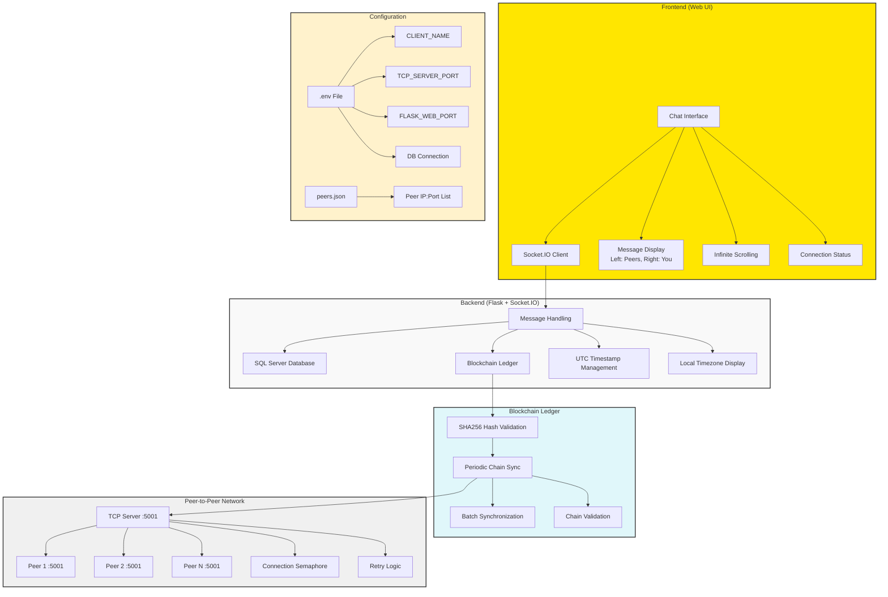

# ey-gds-group-chat-app
 (https://github.com/MadhuriSakunde1995/ey-gds-group-chat-app.git)

A decentralized group chat application where all messages are stored on a blockchain ledger, ensuring consistency, security, and automatic synchronization between peers.

## Table of Contents
- [Features](#features)
- [Architecture Overview](#architecture-overview)
- [Prerequisites](#prerequisites)
- [Installation](#installation)
- [Configuration](#configuration)
- [Running the Application](#running-the-application)
- [Peer Configuration](#peer-configuration)
- [Usage](#usage)
- [Troubleshooting](#troubleshooting)

## Features

### Frontend (Web UI)
Built with **Flask + Socket.IO**, providing a real-time chat interface with:
- Messages displayed on the **left (peers)** or **right (you)**
- Timestamps in user's local timezone (configured via `USER_TIMEZONE`)
- Infinite scrolling to load older messages
- Connection status indicators
- Automatic refresh/check for new messages
- Real-time message synchronization across all peers

### Message Handling
When a user sends a message:
1. Saved in **SQL Server database** (`messages` table for raw messages, `ledger` table for blockchain storage)
2. **Block is created** (sender + UTC timestamp + message + previous hash → new hash using SHA256)
3. Block is **broadcasted to all peers** via TCP connections
4. Message appears with local timezone display while maintaining UTC in blockchain

### Blockchain Ledger
Each message is part of a **blockchain** that:
- Guarantees **tamper resistance** through SHA256 hash links
- **Validates the chain periodically** (every `SYNC_INTERVAL` seconds)
- **Requests batch sync from peers** if validation fails

### Peer-to-Peer Networking
- Nodes connect to peers from **`peers.json`** configuration
- Each node runs a **TCP server** on `TCP_SERVER_PORT` to accept peer connections
- Messages and blocks are shared directly between peers via TCP sockets
- Missing blocks are synced in **configurable batches** (`SYNC_BATCH_SIZE`)
- Connection retries with exponential backoff (`MAX_RETRIES`, `RETRY_DELAY`)

### Synchronization & Reliability
- On startup and periodically, nodes **sync ledgers** ensuring all peers have identical chat history
- Uses **semaphores** to limit concurrent peer connections (`MAX_CLIENTS`)
- **Offline peers** automatically catch up when they reconnect
- Chain validation ensures data integrity across the network

## Architecture Overview



## Prerequisites

Before running the application, ensure you have:

- **Python 3.7+** (recommended: Python 3.8 or higher)
- **pip** (Python package installer)
- **Git** (for cloning the repository)
- **SQL Server** (Express or full version)
- **ODBC Driver 17 for SQL Server**

### System Requirements
- **Operating System**: Windows
- **Network**: TCP connectivity between peers
- **Ports**: `TCP_SERVER_PORT` (default: 5001) and `FLASK_WEB_PORT` (default: 8001)

### SQL Server Setup
1. **Install SQL Server** (Express edition is sufficient)
2. **Install ODBC Driver 17** from [Microsoft's official site](https://docs.microsoft.com/en-us/sql/connect/odbc/download-odbc-driver-for-sql-server)
3. **Create database** named as specified in your `.env` file

## Installation

### Step 1: Clone the Repository
```bash
git clone <repository-url>
cd ey-gds-group-chat-app
```

### Step 2: Install Dependencies
```bash
pip install -r requirements.txt
```

### Dependencies Include:
- `flask` - Web framework
- `flask-socketio` - Real-time communication
- `sqlalchemy` - Database ORM
- `pyodbc` - SQL Server connectivity
- `python-dotenv` - Environment variable management
- `pytz` - Timezone handling

## Configuration

### Environment Configuration (.env)

Create a `.env` file in the root directory:

```env
# User Configuration
CLIENT_NAME=YourDisplayName
ADAPTER_NAME=Connect Tunnel
USER_TIMEZONE=Asia/Kolkata

# Network Ports
TCP_SERVER_PORT=5001
FLASK_WEB_PORT=8001

# Database Configuration (SQL Server)
DB_DRIVER={ODBC Driver 17 for SQL Server}
DB_SERVER=YOUR_SERVER\SQLEXPRESS2019
DB_NAME=chatdb
DB_TRUSTED=yes

# Peer Connection Configuration
MAX_RETRIES=5
RETRY_DELAY=3
MAX_CLIENTS=10

# Synchronization Configuration
SYNC_INTERVAL=30
SYNC_BATCH_SIZE=50
```

### Configuration Parameters Explained:

| Parameter | Description | Default |
|-----------|-------------|---------|
| `CLIENT_NAME` | Your display name in chat | DefaultUser |
| `TCP_SERVER_PORT` | Port for peer TCP connections | 5001 |
| `FLASK_WEB_PORT` | Port for web interface | 8001 |
| `USER_TIMEZONE` | Your timezone for message display | Asia/Kolkata |
| `DB_SERVER` | SQL Server instance name | localhost\SQLEXPRESS |
| `MAX_RETRIES` | Connection retry attempts | 5 |
| `RETRY_DELAY` | Delay between retries (seconds) | 3 |
| `MAX_CLIENTS` | Max concurrent connections | 10 |
| `SYNC_INTERVAL` | Chain sync frequency (seconds) | 30 |
| `SYNC_BATCH_SIZE` | Messages per sync batch | 50 |

### Database Setup

#### Create Database in SQL Server:
```sql
-- Connect to SQL Server and run:
CREATE DATABASE chatdb;
```

#### Test Database Connection:
```bash
python -c "
import pyodbc
conn_str = 'DRIVER={ODBC Driver 17 for SQL Server};SERVER=YOUR_SERVER\\SQLEXPRESS2019;DATABASE=chatdb;Trusted_Connection=yes;'
conn = pyodbc.connect(conn_str)
print('Database connection successful')
conn.close()
"
```

**Note**: The application automatically creates required tables (`messages`, `ledger`) on first run.

## Peer Configuration

### Create peers.json
The `peers.json` file defines other nodes in your network:

### Add Multiple Peers Configuration:
```json
{
  "peers": [
    {
      "ip": "10.176.123.199",
      "port": 5001
    },
    {
      "ip": "10.176.124.50",
      "port": 5001
    }
  ]
}
```

### Important Peer Notes:
- Each peer must be accessible via TCP on the specified port
- IP addresses can be local network (10.x.x.x, 192.168.x.x) or public IPs
- Port must match the `TCP_SERVER_PORT` in the peer's `.env` file
- At least one peer should be online for synchronization
- Your node acts as both client and server for other peers
- Ensure firewall allows TCP connections on specified ports

## Running the Application

### Step 1: Start the Application
``` Run the application
python app.py
```

### Step 2: Verify Startup

Check console output for successful startup:
```
[DB] Tables initialized successfully
[TCP] Server running on 5001
[TCP] Connected to peer 10.176.123.199:5001
[Sync] Sending SYNC_REQUEST to peers with last_hash=abc123 total_count=45
[Web] Starting chat app on port 8001
```

### Step 3: Access Web Interface

Open your browser and navigate to:
```
http://localhost:8001
```

Or from another machine:
```
http://YOUR_IP_ADDRESS:8001
```

### Step 4: Verify Peer Connections

Monitor console for peer connection status:
```
✅ [TCP] Connected to peer 10.176.123.199:5001
✅ [Sync] Added 12 new blocks from peer batch
🌐 [Web] Starting chat app on port 8001
❌ [TCP] Connection attempt 3 to 10.176.123.200:5001 failed: Connection timeout
```

## Usage
### Multiple Node Setup (Testing)

**Node 1 Configuration:**
```bash
# Create node1.env
CLIENT_NAME=Node1_User
TCP_SERVER_PORT=5001
FLASK_WEB_PORT=8001
# ... other settings

python app.py
```

**Node 2 Configuration:**
```bash
# Create node2.env
CLIENT_NAME=Node2_User
TCP_SERVER_PORT=5002
FLASK_WEB_PORT=8002
# ... other settings

# Update peers.json to include Node1:
# {"peers": [{"ip": "127.0.0.1", "port": 5001}]}

python app.py
```

### Monitoring and Logs
The application provides detailed logging:
- **[DB]**: Database operations
- **[TCP]**: Peer connections
- **[Sync]**: Blockchain synchronization
- **[Blockchain]**: Hash validation
- **[Web]**: Flask server status

### TCP Protocol
- `NEW_BLOCK:<json>` - Broadcast new message block
- `SYNC_REQUEST:<json>` - Request missing blocks
- `SYNC_RESPONSE:<json>` - Send requested blocks

## Security Considerations

- **Blockchain Integrity**: SHA256 hashing prevents message tampering
- **Peer Authentication**: Currently relies on network-level security
- **Database Security**: Uses SQL Server trusted connections
- **Network Security**: Consider VPN or secure networks like Connect Tunnel for peer communication
